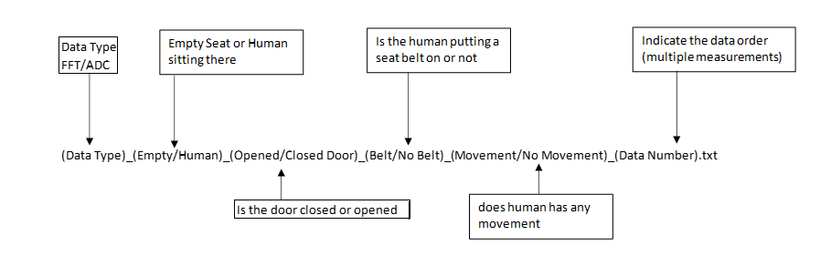

# Data 

In this directory, you will find data separated in folder. To understand how we keep data, see file [Data_detail.xlsx](./Data_detail.xlsx).

Filenames of data will be as the following 

For example.

Data type = FFT
Human 1 = H1
Opened door = O
Belt = B
Movement = M
Data Number = 2

then filename is "FFT_H1_OBM_2.txt"

